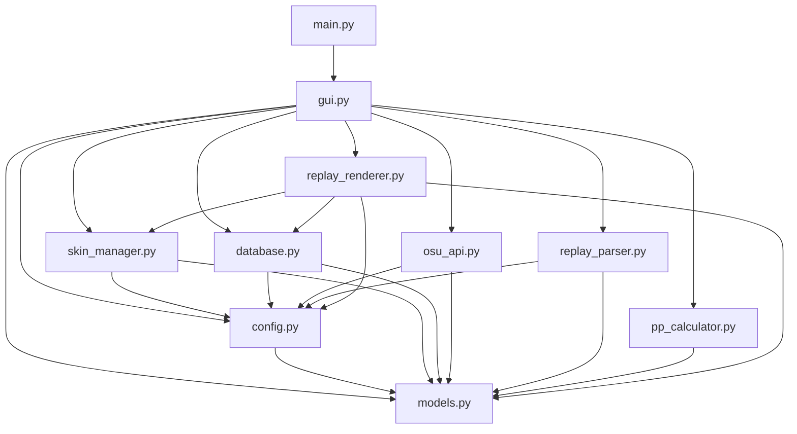

# План разбивки проекта на файлы

## Обзор

Проект `osu! Replay Converter` был разбит на модульную структуру для улучшения читаемости, поддержки и масштабируемости кода.

## Структура директорий

```
replay bot osu/
├── main.py                 # Точка входа в приложение
├── README.md               # Документация проекта
├── src/                    # Исходный код приложения
│   ├── __init__.py        # Инициализация пакета
│   ├── config.py          # Конфигурация приложения
│   ├── models.py          # Модели данных (dataclass)
│   ├── skin_manager.py    # Менеджер скинов
│   ├── database.py        # Менеджер базы данных
│   ├── osu_api.py         # API osu!
│   ├── replay_parser.py   # Парсер реплеев
│   ├── pp_calculator.py   # Калькулятор PP
│   ├── replay_renderer.py # Рендерер реплеев
│   └── gui.py             # Графический интерфейс
└── plans/                 # Планы и документация
    └── refactoring_plan.md
```

## Описание файлов

### 1. `main.py` (Точка входа)
- Главная функция запуска приложения
- Проверка зависимостей
- Инициализация и запуск GUI

### 2. `src/config.py` (Конфигурация)
- Настройка логирования
- Пути к директориям приложения
- Константы (DEFAULT_SKIN_NAME)
- Настройки рендеринга по умолчанию

**Классы и функции:**
- `logger` - глобальный логгер
- `APP_DIR`, `CONFIG_FILE`, `DATABASE_FILE`, `SKINS_DIR` - пути
- `DEFAULT_SKIN_NAME` - имя скина по умолчанию
- `DEFAULT_RENDER_SETTINGS` - настройки рендеринга

### 3. `src/models.py` (Модели данных)
- Dataclass модели для хранения данных приложения

**Классы:**
- `SkinInfo` - информация о скине (имя, путь, автор, превью и т.д.)
- `BeatmapAttributes` - атрибуты сложности карты (aim, speed, od, ar и т.д.)
- `ReplayData` - данные реплея (игрок, счет, комбо, хиты, моды и т.д.)

### 4. `src/skin_manager.py` (Менеджер скинов)
- Управление скинами osu!
- Импорт/экспорт скинов
- Валидация скинов

**Классы:**
- `SkinManager` - основной класс менеджера скинов
  - `load_skins()` - загрузка скинов
  - `save_skins_metadata()` - сохранение метаданных
  - `import_skin()` - импорт скина
  - `export_skin()` - экспорт скина
  - `delete_skin()` - удаление скина
  - `get_skin_preview_image()` - получение превью
  - `validate_skin()` - валидация скина

### 5. `src/database.py` (База данных)
- Управление SQLite базой данных
- Хранение атрибутов карт
- История реплеев
- Настройки рендеринга

**Классы:**
- `DatabaseManager` - менеджер базы данных
  - `init_database()` - инициализация таблиц
  - `get_beatmap_attributes()` - получение атрибутов карты
  - `save_beatmap_attributes()` - сохранение атрибутов
  - `add_replay_to_history()` - добавление в историю
  - `get_render_settings()` - получение настроек
  - `save_render_settings()` - сохранение настроек

### 6. `src/osu_api.py` (API osu!)
- Работа с официальным API osu!
- Получение информации о картах

**Классы:**
- `OsuAPI` - клиент API osu!
  - `get_beatmap_attributes()` - получение атрибутов карты
  - `get_beatmap_by_md5()` - поиск карты по MD5

### 7. `src/replay_parser.py` (Парсер реплеев)
- Парсинг файлов .osr
- Извлечение данных из реплея

**Классы:**
- `ReplayParser` - парсер реплеев
  - `parse_replay()` - статический метод парсинга

### 8. `src/pp_calculator.py` (Калькулятор PP)
- Расчет Performance Points
- Расчет точности
- Компоненты PP (Aim, Speed, Accuracy, Flashlight)

**Классы:**
- `OsuPPCalculator` - калькулятор PP
  - `calculate_accuracy()` - расчет точности
  - `compute_effective_miss_count()` - эффективные пропуски
  - `calculate_total_pp()` - общий расчет PP
  - `_compute_aim_value()` - Aim PP
  - `_compute_speed_value()` - Speed PP
  - `_compute_accuracy_value()` - Accuracy PP
  - `_compute_flashlight_value()` - Flashlight PP

### 9. `src/replay_renderer.py` (Рендерер)
- Рендеринг реплеев в видео
- Управление настройками рендеринга

**Классы:**
- `ReplayRenderer` - рендерер реплеев
  - `render_replay()` - рендеринг реплея
  - `_build_render_command()` - создание команды
  - `_create_dummy_video()` - создание заглушки
  - `_save_render_info()` - сохранение информации
  - `update_render_settings()` - обновление настроек

### 10. `src/gui.py` (Графический интерфейс)
- Tkinter GUI приложения
- Вкладки: Реплей и PP, Скины, Рендеринг, История, Настройки

**Классы:**
- `OsuReplayConverterApp` - главное приложение
  - `setup_ui()` - настройка интерфейса
  - `setup_main_tab()` - вкладка реплея
  - `setup_skins_tab()` - вкладка скинов
  - `setup_render_tab()` - вкладка рендеринга
  - `setup_history_tab()` - вкладка истории
  - `setup_settings_tab()` - вкладка настроек
  - `analyze_replay()` - анализ реплея
  - `calculate_pp()` - расчет PP
  - `import_skin()` - импорт скина
  - `start_rendering()` - запуск рендеринга
  - И другие методы управления интерфейсом

### 11. `src/__init__.py` (Инициализация пакета)
- Экспорт основных классов и функций
- Удобный импорт модулей

## Зависимости между модулями



## Преимущества новой структуры

1. **Модульность** - каждый файл отвечает за одну область функциональности
2. **Читаемость** - код легче читать и понимать
3. **Поддержка** - проще находить и исправлять ошибки
4. **Тестируемость** - каждый модуль можно тестировать отдельно
5. **Масштабируемость** - легко добавлять новые функции
6. **Переиспользование** - модули можно использовать в других проектах

## Запуск приложения

```bash
python main.py
```

## Установка зависимостей

```bash
pip install ossapi OsuPyParser pillow
```

или

```bash
pip install -r requirements.txt
```

## Статус выполнения

- [x] Создана структура директорий
- [x] Создан `src/config.py`
- [x] Создан `src/models.py`
- [x] Создан `src/skin_manager.py`
- [x] Создан `src/database.py`
- [x] Создан `src/osu_api.py`
- [x] Создан `src/replay_parser.py`
- [x] Создан `src/pp_calculator.py`
- [x] Создан `src/replay_renderer.py`
- [ ] Создан `src/gui.py`
- [ ] Обновлен `main.py`
- [ ] Создан `src/__init__.py`
